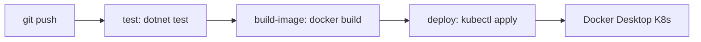

# .NET CI/CD

Пример .NET репозитория с pipeline **test → build-image → deploy** в локальный Kubernetes (Docker Desktop).

Связанные разделы: [[Запуск проекта]] · [[Схема проекта]]

---

## Что создаёт Terraform

- Docker registry (`environment-registry`, порт `30500` по умолчанию) — для push/pull образов из CI
- Kubeconfig в act_runner (если `mount_kubeconfig_in_runner = true`)

Репозиторий **не создаётся** Terraform. Шаблон для ручного развёртывания: `terraform/templates/dotnet/` (см. README в каталоге).

---

## Предварительные требования

- **Git** в PATH
- **Kubernetes в Docker Desktop** включён: Settings → Kubernetes → Enable Kubernetes
- `kubectl` работает: `kubectl cluster-info`
- Файл `~/.kube/config` существует

---

## Переменные Terraform (инфраструктура CI)

| Переменная | По умолчанию | Описание |
|------------|--------------|----------|
| `create_registry` | `true` | Локальный Docker registry |
| `registry_port` | `30500` | Порт registry на хосте |
| `kubeconfig_host_path` | `~/.kube/config` | Путь к kubeconfig на хосте |
| `mount_kubeconfig_in_runner` | `true` | Монтировать kubeconfig в runner |

---

## Pipeline



| Job | Описание |
|-----|----------|
| `test` | `dotnet restore` + `dotnet test` |
| `build-image` | `docker build`, тег `dotnet-app:latest` |
| `deploy` | push в registry + `kubectl apply -f k8s/` |

Deploy выполняется только при push в `main` / `master`.

---

## Проверка после deploy

```powershell
terraform output registry_url
kubectl get pods -n environment
curl http://localhost:30080/health
```

Или:

```powershell
kubectl port-forward svc/dotnet-app 8080:8080 -n environment
curl http://localhost:8080/health
```
