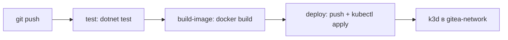

# .NET CI/CD

Пример .NET репозитория с pipeline **test → build-image → deploy** в k3d-кластер в `gitea-network`.

Связанные разделы: [[Запуск проекта]] · [[Схема проекта]]

---

## Что создаёт Terraform

- Docker registry `docker-registry:5000` в `gitea-network`
- k3d-кластер с доступом к registry; kubeconfig для CI — **Gitea secret `KUBE_CONFIG`**

Репозиторий **не создаётся** Terraform. Шаблон: `templates/dotnet/`.

---

## Предварительные требования

- **k3d** в PATH — установка и проверка: [[Установка компонентов#6. k3d]]
- `terraform apply` поднял registry и k3d
- В Gitea repository secret **`KUBE_CONFIG`**: `terraform output -raw kubeconfig_runner_base64`
- `kubectl --kubeconfig terraform/.generated/kubeconfig-local get nodes` работает

---

## Переменные Terraform (инфраструктура CI)

| Переменная | По умолчанию | Описание |
|------------|--------------|----------|
| `registry_container_name` | `docker-registry` | DNS-имя registry |
| `registry_address` | `docker-registry:5000` | Адрес для образов (output) |
| `k8s_cluster_name` | `local` | Имя k3d-кластера |
| `kubeconfig_path` | `.generated/kubeconfig-local` | kubectl с хоста |
| `kubeconfig_runner_base64` | (output, sensitive) | Secret `KUBE_CONFIG` в Gitea |

### Gitea Secrets

| Secret | Описание |
|--------|----------|
| `KUBE_CONFIG` | base64 содержимого `kubeconfig-local-runner` ([actions-hub/kubectl](https://github.com/actions-hub/kubectl)) |
| `KUBE_CONTEXT` | опционально, имя контекста (`k3d-local`) |

---

## Pipeline



| Job | Описание |
|-----|----------|
| `test` | `dotnet restore` + `dotnet test` |
| `build-image` | `docker build`, тег `app:latest` |
| `deploy` | push в `host.docker.internal:30500` + `kubectl apply` (kubeconfig из `secrets.KUBE_CONFIG`) |

---

## Проверка после deploy

```powershell
kubectl --kubeconfig terraform/.generated/kubeconfig-local get pods -n apps
kubectl --kubeconfig terraform/.generated/kubeconfig-local port-forward svc/dotnet-app 8080:8080 -n apps
```

Проверка `/health` — через port-forward на выбранный порт.
