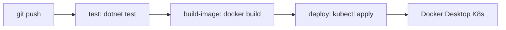

# .NET CI/CD

Автоматически разворачиваемый .NET репозиторий с pipeline **test → build-image → deploy** в локальный Kubernetes (Docker Desktop).

Связанные разделы: [[Запуск проекта]] · [[Схема проекта]]

---

## Что создаёт Terraform

При `create_dotnet_repo = true` (по умолчанию):

1. Репозиторий в Gitea: `admin/dotnet-app`
2. Шаблон .NET 8 Web API + тесты + Dockerfile
3. Workflow `.gitea/workflows/ci.yml`
4. Манифесты Kubernetes в `k8s/`

Шаблоны: `terraform/templates/dotnet/`

---

## Предварительные требования

- **Git** в PATH (для push репозитория при `terraform apply`)
- **Kubernetes в Docker Desktop** включён: Settings → Kubernetes → Enable Kubernetes
- `kubectl` работает: `kubectl cluster-info`
- Файл `~/.kube/config` существует

---

## Переменные Terraform

| Переменная | По умолчанию | Описание |
|------------|--------------|----------|
| `create_dotnet_repo` | `true` | Создать репозиторий |
| `dotnet_repo_name` | `dotnet-app` | Имя репозитория |
| `dotnet_image_name` | `dotnet-app` | Имя Docker-образа и Deployment |
| `k8s_namespace` | `environment` | Namespace в k8s |
| `k8s_node_port` | `30080` | NodePort сервиса |
| `kubeconfig_host_path` | `~/.kube/config` | Путь к kubeconfig на хосте |
| `mount_kubeconfig_in_runner` | `true` | Монтировать kubeconfig в runner |

---

## Pipeline



| Job | Описание |
|-----|----------|
| `test` | `dotnet restore` + `dotnet test` |
| `build-image` | `docker build`, тег `dotnet-app:latest` |
| `deploy` | `kubectl apply -f k8s/` через образ `bitnami/kubectl` |

Deploy выполняется только при push в `main` / `master`.

---

## Проверка после deploy

```powershell
terraform output dotnet_repo_url
kubectl get pods -n environment
curl http://localhost:30080/health
```

Или:

```powershell
kubectl port-forward svc/dotnet-app 8080:8080 -n environment
curl http://localhost:8080/health
```

---

## Отключить автосоздание репозитория

В `terraform.tfvars`:

```hcl
create_dotnet_repo = false
```
