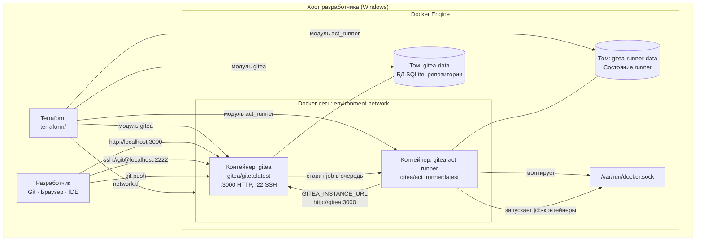
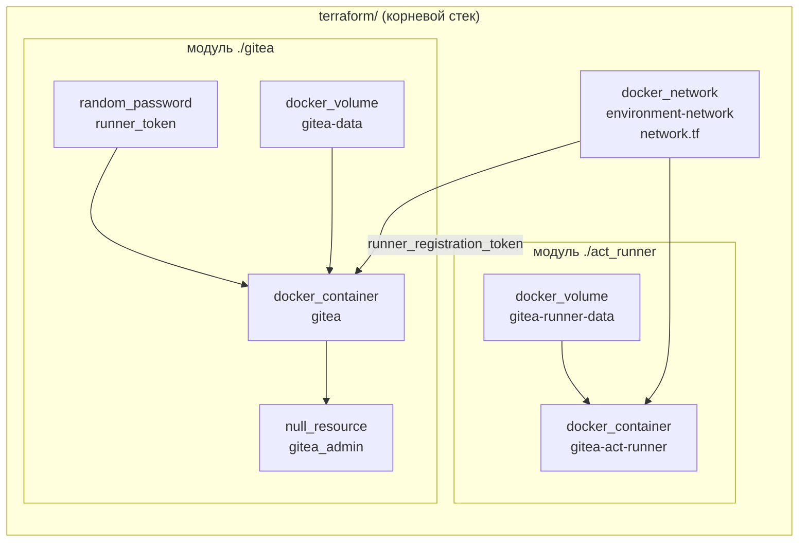
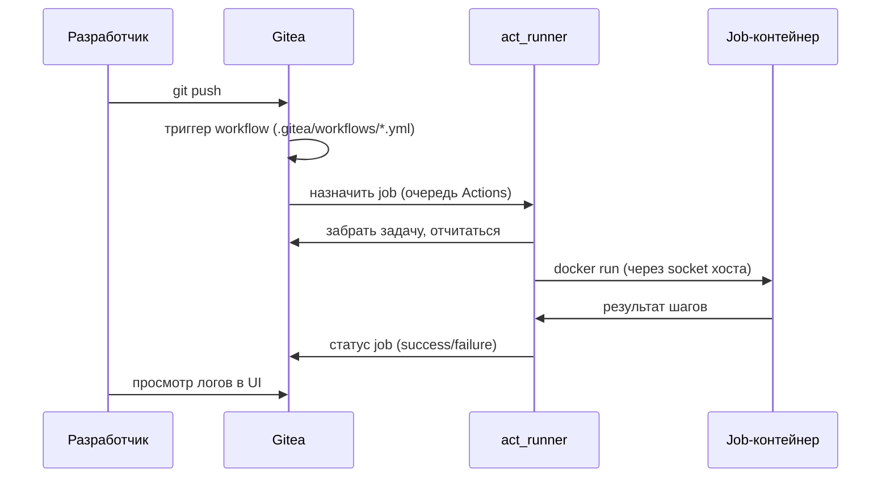
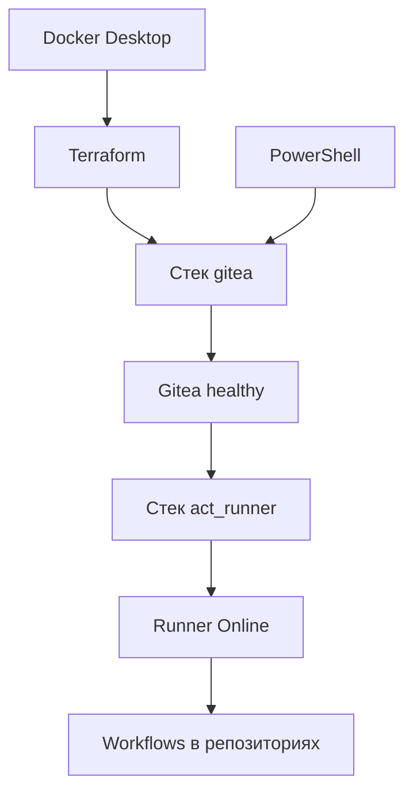

# Схема проекта

Архитектура локальной среды: компоненты, сети, тома и потоки данных.

Связанные разделы: [[Главная]] · [[Запуск проекта]] · [[Установка компонентов]]

---

## Общая схема (одна машина)

Типичный сценарий: Gitea и act_runner на одном хосте с Docker Desktop.



---

## Корневой Terraform-стек

Рекомендуемая схема: один state в `terraform/`, сеть на верхнем уровне, модули подключаются из подкаталогов.



| Уровень | Каталог / файл | Создаёт |
|---------|----------------|---------|
| Корень | `terraform/network.tf` | Docker-сеть `environment-network` |
| Модуль | `terraform/gitea/` | Том, контейнер Gitea, токен, admin |
| Модуль | `terraform/act_runner/` | Том runner, контейнер act_runner |

### Раздельный запуск (опционально)

Модули `gitea/` и `act_runner/` можно применять по отдельности, но **сеть создаётся только в корневом стеке** (`terraform/network.tf`). Перед раздельным запуском примените сеть из корня или весь корневой стек.

---

## Сетевая модель

### Сетевая связность

| Откуда | Куда | Адрес | Назначение |
|--------|------|-------|------------|
| Браузер / Git (хост) | Gitea | `localhost:3000`, `localhost:2222` | UI и SSH с машины разработчика |
| act_runner | Gitea | `http://gitea:3000` | API внутри `environment-network` |
| Gitea | Runner | `environment-network` | Постановка job'ов Actions |

---

## Поток CI/CD



**Метки runner по умолчанию:** `self-hosted`, `linux`, `docker`  
В workflow указывайте `runs-on: self-hosted` (или другую метку из `runner_labels`).

---

## Хранение данных

| Том Docker | Содержимое |
|------------|------------|
| `gitea-data` | SQLite БД (`/data/gitea/gitea.db`), git-репозитории, артефакты, настройки |
| `gitea-runner-data` | Регистрация и рабочее состояние act_runner |

База данных: **SQLite** (файл внутри тома). Для продакшена в других сценариях часто используют PostgreSQL — в текущем Terraform зашит SQLite.

---

## Порты и переменные окружения Gitea

Ключевые настройки контейнера `gitea` (из `terraform/gitea/main.tf`):

| Переменная / параметр | Значение по умолчанию |
|-----------------------|----------------------|
| `GITEA__server__HTTP_PORT` | 3000 |
| `GITEA__server__SSH_PORT` | 2222 |
| `GITEA__server__ROOT_URL` | http://localhost:3000 |
| `GITEA__actions__ENABLED` | true |
| `GITEA_RUNNER_REGISTRATION_TOKEN` | генерируется Terraform |

---

## Зависимости между компонентами



Без работающего Docker ни один стек не применится. Без успешного healthcheck Gitea не создастся admin (provisioner завершится с ошибкой). Без токена из стека gitea runner не зарегистрируется.

---

## Файловая структура Terraform

```
terraform/
├── main.tf              # модули gitea + act_runner
├── network.tf           # общая Docker-сеть
├── variables.tf
├── outputs.tf
├── terraform.tfvars.example
├── providers.tf
├── versions.tf
├── gitea/               # модуль Gitea (подключается к сети из корня)
│   ├── main.tf
│   ├── variables.tf
│   └── outputs.tf
└── act_runner/          # модуль runner
    ├── main.tf
    ├── variables.tf
    ├── outputs.tf
    └── terraform.tfvars.example
```

Далее: [[Запуск проекта]] · [[Справочник и устранение неполадок]]
